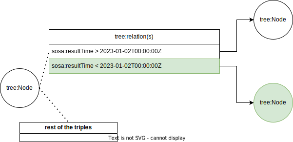

## Guided Link traversal for the TREE specification
{:#guided_link_traversal}

The objective of GLTQP is to reduce the search domain of a query engine by selecting data sources based on knowledge 
acquired before or during execution.
Our approach to GLTQP consists of restricting the links 
that the query engine can follow using a combination of prior knowledge about the structural properties of the TREE specification,
and the [hypermedia descriptions](cite:cites thomasFieldingPhdThesis) of fragment constraints.

More formally, this consists of creating a [reachability criterium](cite:cites hartig2012) 
that can discriminate triples encountered
inside a TREE document with the objective to decide if dereferencing the URLs in
those triples will contribute to the results for the query.
A conceptual example is presented at  based on the query of ,
where we see in green that the query engine only considers the triples pertaining to
the relation between the fragment and follow the relation that is compatible with the SPARQL filter expression.

<figure id="running_example">

<figcaption markdown="block">
Running example of our GLTQP approach based on .
</figcaption>
</figure>

To determine if a URL will lead to another fragment in the current TREE dataset,
or another document elsewhere on the Web,
we need to consider the structural aspects of the TREE specification.
Concretely, fragments of TREE datasets
are called [`tree:Node`](https://treecg.github.io/specification/#Node)s.
Those fragments contain hypermedia descriptions of the next `tree:Node`s that are related to this node.
Those descriptions are called [`tree:Relation`](https://treecg.github.io/specification/#Relation),
they characterize the link between the current `tree:Node` and another via the predicate `tree:node`.
An example of the descriptions of such a TREE dataset is shown 
in  using the [Turtle](https://www.w3.org/TR/turtle/) serialization.

The second part of our reachability criterium pertains to the compatibility between the constraint
of the `tree:Node` and the SPARQL Filter expression. 
The constraint of the `tree:Relation`, can be conceptualized as a boolean equation.
This equation has a variable, a comparator and a literal,
we can exemplify it by the following simple expression; $$ t \leq unixTime(\text{2023-01-07T00:00:00Z}) $$.
The left hand of the expression, the variable, is contingent to a SPARQL query expression.
It is the variable pertaining to the property that the `tree:Relation` is targeting.
The property targeted by the relation is defined by the object of the triple
having the predicate `tree:path`.
In the example of  it was $$ ?t $$, because the example of 
has the `tree:path` property `sosa:resultTime`. 
The boolean operator such as; equal, greater than, is described by the [RDF type of the TREE relation](https://treecg.github.io/specification/#Relation), in Turtle serialization it is the object of the triple with the predicate "`a`".
Finally, the literal is simply represented by the object of the triple in the relation,
containing the predicate `tree:value`.

Given the boolean representation of the `tree:Relation` and the SPARQL filter expression that is already a boolean expression,
a solver can evaluate if the combination of those two expressions is resolvable, like in [our open source implementation](https://github.com/constraintAutomaton/comunica-feature-link-traversal/tree/feature/time-filtering-tree-sparqlee-implementation) where we evaluate the solution domain of the equation to find the solvability, hence, pruning certainly non-contributing relations.

Q1

PREFIX sosa: <http://www.w3.org/ns/sosa/> 
PREFIX xsd: <http://www.w3.org/2001/XMLSchema#> 
PREFIX wgs: <http://www.w3.org/2003/01/geo/wgs84_pos#>
PREFIX etsi: <https://saref.etsi.org/core/>
    
SELECT * WHERE {
    ?s etsi:hasTimestamp ?t.
?s etsi:hasValue ?result.
?s etsi:measurementMadeBy ?sensor.
?sensor <https://dahcc.idlab.ugent.be/Ontology/Sensors/analyseStateOf> ?stateOf.
?sensor <https://saref.etsi.org/core/measuresProperty> <https://dahcc.idlab.ugent.be/Homelab/SensorsAndActuators/energy.consumption>

    FILTER(?t="2022-01-03T10:57:54.000000"^^xsd:dateTime)
}

Q2

PREFIX sosa: <http://www.w3.org/ns/sosa/> 
PREFIX xsd: <http://www.w3.org/2001/XMLSchema#> 
PREFIX wgs: <http://www.w3.org/2003/01/geo/wgs84_pos#>
PREFIX etsi: <https://saref.etsi.org/core/>
    
SELECT * WHERE {
    ?s etsi:hasTimestamp ?t.
?s etsi:hasValue ?result.
?s etsi:measurementMadeBy ?sensor.
?sensor <https://dahcc.idlab.ugent.be/Ontology/Sensors/analyseStateOf> ?stateOf.
?sensor <https://saref.etsi.org/core/measuresProperty> <https://dahcc.idlab.ugent.be/Homelab/SensorsAndActuators/energy.consumption>

    FILTER(?t="2022-01-03T19:54:22.469000"^^xsd:dateTime)
}

Q3

PREFIX sosa: <http://www.w3.org/ns/sosa/> 
PREFIX xsd: <http://www.w3.org/2001/XMLSchema#> 
PREFIX wgs: <http://www.w3.org/2003/01/geo/wgs84_pos#>
PREFIX etsi: <https://saref.etsi.org/core/>
    
SELECT * WHERE {
    ?s etsi:hasTimestamp ?t.
?s etsi:hasValue ?result.
?s etsi:measurementMadeBy ?sensor.
?sensor <https://dahcc.idlab.ugent.be/Ontology/Sensors/analyseStateOf> ?stateOf.
?sensor <https://saref.etsi.org/core/measuresProperty> <https://dahcc.idlab.ugent.be/Homelab/SensorsAndActuators/energy.consumption>

    FILTER(?t>="2022-01-03T15:00:00.000000"^^xsd:dateTime && ?t<"2022-01-03T15:30:00.000000"^^xsd:dateTime)
}

Q4

PREFIX sosa: <http://www.w3.org/ns/sosa/> 
PREFIX xsd: <http://www.w3.org/2001/XMLSchema#> 
PREFIX wgs: <http://www.w3.org/2003/01/geo/wgs84_pos#>
PREFIX etsi: <https://saref.etsi.org/core/>
    
SELECT * WHERE {
    ?s etsi:hasTimestamp ?t.
?s etsi:hasValue ?result.
?s etsi:measurementMadeBy ?sensor.
?sensor <https://dahcc.idlab.ugent.be/Ontology/Sensors/analyseStateOf> ?stateOf.
?sensor <https://saref.etsi.org/core/measuresProperty> <https://dahcc.idlab.ugent.be/Homelab/SensorsAndActuators/energy.consumption>

    FILTER((?t>="2022-01-03T15:00:00.000000"^^xsd:dateTime && ?t<"2022-01-03T20:00:00.000000"^^xsd:dateTime) && !(?t>="2022-01-03T15:10:00.000000"^^xsd:dateTime && ?t<"2022-01-03T15:40:00.000000"^^xsd:dateTime))
}

